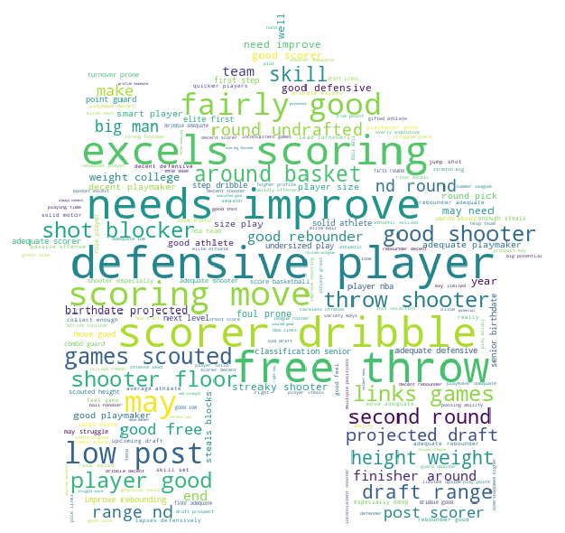

# NBAplayerRoleAnalysis
- Final Project for BYGB7978 at Fordham University

---------------------------------
update at 2/6/2020

## Introduction
In the past decades of years, NBA basketball players have been divided into five positions, including Centre, Power Forward, Small Forward, Position Guard, and Shooting Guard. However, with the springing up of Golden State Warriors, a ‘small ball’ strategy has emerged. Under this sports fashion, players of a team are more flexible and convertible. The traditional basketball player categories are facing out of use and a waste of sportsman’s talent and developing draft picks that do not fit their systems. Actually, NBA observers and coaches have already noticed nowadays players have skills that exceed their predefined positions and even already defined some new roles such as combo guard(guard has both shooting and organizing skills of SG and PG). Scouts and coaches are needing a new way to recognize and classify potential players. Our research is conducted according to the various skills of a player and assort them into eight new positions. On the basis of that, we can form a new player-type system and help the team to train more efficiently.

## Data Analysis 
### Text
We divide our analysis into two main counterparts. In the first section, we define new player roles by using text analytics techniques to support the second section, predictive analysis. In the second section, we apply KMeans Clustering to come up with 8 player types. Ideally, the first part should work to provide solid explanations and support to the result of the second part, which are the final clusters we received from KMeans Clustering. 
Since the scout reports we get are inside the stored HTML document, we have to parse the document to get the pure text content first. In this specific case, we choose Xpath as the main parsing method. To introduce the method, XPath (XML Path Language) is a query language for selecting nodes from an XML document. In addition, XPath may be used to compute values (e.g., strings, numbers, or Boolean values) from the content of an XML document. In Python, we can find Xpath in a package called Etree. In fact, the web structure of every player page is relatively similar, this enables us to parse all webpages as a whole by performing Python loops. In the next step, we have to clean the text by removing stopwords, punctuations and some other non-alphabetical syntax. By importing Python package Regular Expressions, we can handle all the punctuations. On top of that, we utilize NLTK to remove stopwords. In the final step, we generate a WordCloud from the text we processed, in a sense to deliver our results through visualization.  

Based on WordCloud, we classify words into two categories. The first classification includes words like scoring, defensive and dribble that express player functions when they are on the floor; Similarly, the second classification entails words like scorer, shooter, and shot-blocker that explain player roles. 

| Player Function & Behaviours                | Player Roles                                |
| --------------------------------------------|-------------------------------------------- |
| scoring, shooting, dribbling, move,         | shooter, scorer, big man, shot-blocker,      |
| foul prone, around basket, good defensive,  | playmaker, good rebounder, defensive player, |
| low post, free throw                        | finisher, post scorer, adequate playmaker |

We manually divided some of the words into two classes based on the WordCloud. Additionally, we seek to more smoothly explain our final decision of player roles due to the fact that the created WordCloud conducts limited information, We use Gensim, which is a Python package, to apply more Natural Language Processing (NLP) techniques instead of human effort. Gensim is specially designed for ‘Topic Modelling for Humans’. If one is unfamiliar with topic modeling, it is a technique to extract the underlying topics from large volumes of text. Compare to NLTK, Gensim is more novice-friendly while performing similar NLP functions. 
Before we form the WordCloud, we had already cleaned up a text string with all the tokenized words included, so we continue to create a corpus using Gensim functions. After that, we use a Latent Dirichlet allocation model to cluster 8 topics. In fact, it seems that topics 1,4 and 7 focus on the same topic, which is playmakers and combo guards; topic 3, 6 focus on shooters and topic 5 focuses on inside players.

### Predictive Analysis
We divide our predictive analysis into two parts, including Linear Discriminant Analysis (LDA) and KMeans Clustering. LDA is used to reduce the dimensions of our data records and then we apply KMeans to generate what we want.
- LDA

    When dimensions increase, the available data becomes more and more sparse. Further increasing the dimensionality, on the one hand,       it will result in a decrease in classifier performance. On the other hand, classifiers learn everything well on specific instances       and exceptions of the certain training dataset. Therefore, the final classifier is not able to predict real-world data. This is         known as the “Curse of Dimensionality”, as figure 2 shows. In our case, players’ feature statistics, such as point per game (PPG),       assist per game (APG) and so on, represent a dimension, which in total is 22 in the dataset. In order to obtain a statistically         sound result, we must decrease the dimensions of our record. LDA is a great method to achieve what we need.

- KMeans

    After processing the dataset, we utilize KMeans to cluster player types. It is a powerful algorithm to find the cluster centers that     best represent certain regions of the data, as figure 3 shows.
    
- Result
    Eventually, the results are as shown below. We find the top 10 features importance of player statistics in figure 5 and figure 6         tells that each color represents a player type. Black points are data records in our case and white crosses refer to the center of       each cluster. 

